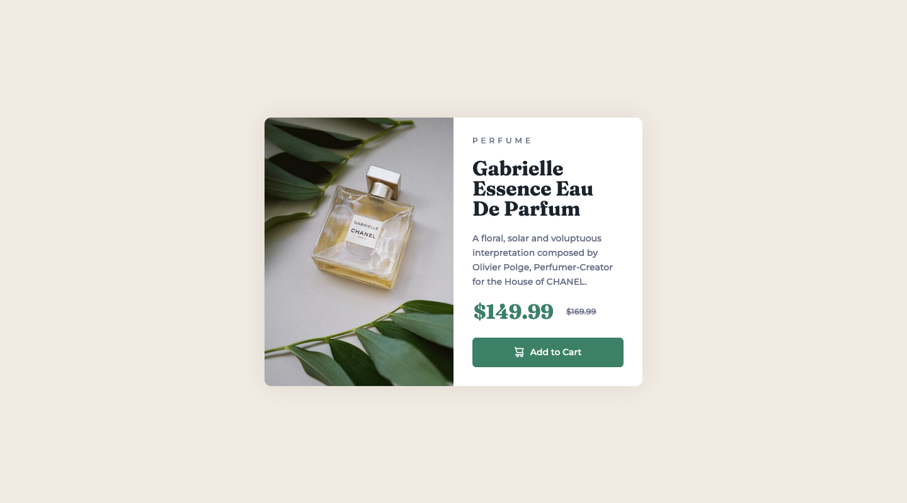

# Product preview card component solution

This is a solution to the [Product preview card component challenge on Frontend Mentor](https://www.frontendmentor.io/challenges/product-preview-card-component-GO7UmttRfa).

Frontend Mentor challenges help you improve your coding skills by building realistic projects.

## Table of Content

- [Screenshot](#screenshot)
- [Links](#links)
- [Built With](#built-with)
- [Author](#author)

## Screenshot

## Links

- [Solution URL](https://github.com/ionStici/product-preview-card-component)
- [Live Site URL](https://ionstici.github.io/product-preview-card-component)

## Built With

- HTML
- CSS
- Flexbox
- CSS Grid

## Author

- [GitHub](https://github.com/ionStici)
- [Frontend Mentor](https://www.frontendmentor.io/profile/ionStici)
- [Twitter](https://twitter.com/IonStici3)
